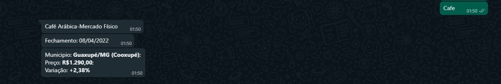

# Coffee Bot WhatsApp

## Info

```
Sending the correct message to the Bot, it will perform a Web Scrapping in noticiasagricolas.com.br website bringing the latest region coffee price.
```

### Example



---
## Tools
- JSDOM: *WebScrapping*
- Twilio: *WhatsApp Messaging*
- Express: *Node.js server*
- Ngrok: *Set my localhost:3000 as public for testing the connection with Twilio*